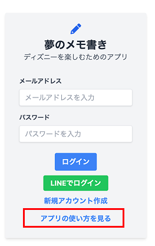

# 🌟 夢のメモ書き - ディズニープランニングアプリ 🎠

ディズニー旅行をもっと楽しく、もっと効率的に！  
スケジュール・予算・コーデ情報などをまとめて管理できるスマホ向けWebアプリです。

---

## 🔍 アプリ概要

- 複数人でディズニー旅行を計画・共有
- スケジュール、精算管理、コーデ記録などを一元管理
- スマホファースト設計で操作も簡単

---

## 🧑‍💻 使用技術

| 分類         | 使用技術               |
|--------------|------------------------|
| 言語         | Ruby / JavaScript      |
| フレームワーク | Ruby on Rails 6         |
| フロント     | Tailwind CSS           |
| データベース | PostgreSQL             |
| その他       | Docker / Render / GitHub |

---

## 🛠️ 主な機能

- ✅ アカウント作成（LINEログイン対応）
- ✅ ルーム作成・参加（旅行単位で管理）
- ✅ スケジュール登録（ピン固定対応）
- ✅ 精算管理（事後精算・レシート画像付き）
- ✅ コーデ記録（カチューシャ・服・バッグ・靴など登録可能）
- ✅ メンバー一覧・管理機能

---

## 🚧 今後追加予定の機能

- ⭐️ お気に入り機能（フード・グッズを事前登録）
- ✅ やりたいことTODO（絶対やりたい項目を共有）
- 🚫 苦手TODO（避けたい行動・注意点を共有）

---

## 📱 スマホ画面イメージ

---

## 🚀 アプリURL・テスト情報

**🔗 本番URL**  
https://schedule-g574.onrender.com/login

**🧪 テストアカウント情報**  

| ユーザー | メールアドレス         | パスワード  |
|----------|------------------------|-------------|
| A        | test1@example.com      | password    |
| B        | test2@example.com      | password    |

**🛏 テストルーム**  
- 部屋番号：`9999`  
- パスワード：`999999`

---

## 📄 補足資料（PDF）

より詳細なアプリの目的・背景・画面設計・操作説明などは以下のPDFをご参照ください。  
→ 🚧ただいま作成中🚧 

---

## 📌 備考

- スマホファーストで開発（レスポンシブ対応済）
- Tailwind CSS によりUIを柔軟かつ直感的に設計
- Docker × Render構成で本番反映もスムーズに対応

---

## 🙏 お問い合わせ

ご質問やご要望があればお気軽にご連絡ください。

※ルーム作成後に別アカウントで参加して、複数人操作をお試しいただけます。
※アプリの使い方は、ログイン後の画面上部からいつでも確認できます。

